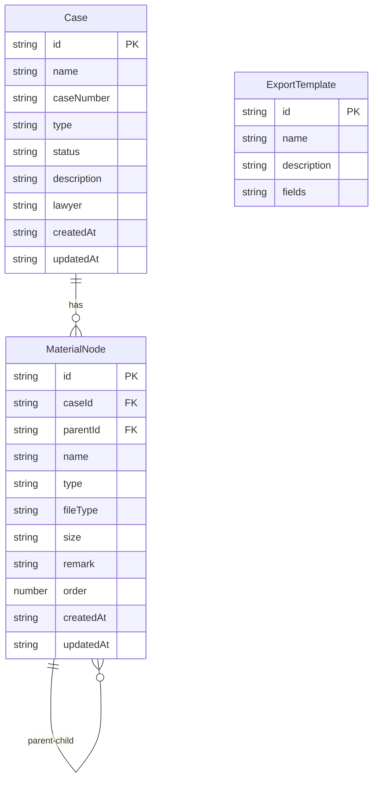

## 1. 架构设计

```mermaid
graph TB
    "前端 Vue3 应用" --> "Vue Router 路由管理"
    "前端 Vue3 应用" --> "Composables 业务逻辑"
    "前端 Vue3 应用" --> "Mock 数据层"
    "Vue Router 路由管理" --> "案件列表页"
    "Vue Router 路由管理" --> "材料树管理页"
    "Vue Router 路由管理" --> "导出清单页"
    "Composables 业务逻辑" --> "useCaseManagement"
    "Composables 业务逻辑" --> "useMaterialTree"
    "Composables 业务逻辑" --> "useExportList"
    "Mock 数据层" --> "LocalStore 持久化"
```

## 2. 技术说明

- **前端**：Vue 3 + TypeScript + Tailwind CSS + Vite
- **初始化工具**：vite-init (vue-ts 模板)
- **后端**：无（纯前端，使用 Mock 数据 + localStorage 持久化）
- **数据库**：无后端数据库，使用浏览器 localStorage 存储
- **导出功能**：使用前端库生成 PDF 和 Excel 文件
  - PDF：jsPDF
  - Excel：SheetJS (xlsx)

## 3. 路由定义

| 路由 | 用途 |
|------|------|
| `/` | 重定向到案件列表页 |
| `/cases` | 案件列表页，展示所有案件卡片 |
| `/cases/:id` | 案件材料树管理页，展示该案件的材料树 |
| `/cases/:id/export` | 导出清单页，选择材料并导出 |

## 4. API 定义

本项目为纯前端项目，不涉及后端 API。数据通过 Composables 层管理，底层使用 localStorage 持久化。

### 4.1 核心数据类型

```typescript
interface Case {
  id: string
  name: string
  caseNumber: string
  type: 'civil' | 'criminal' | 'administrative' | 'arbitration'
  status: 'active' | 'closed' | 'archived'
  description: string
  lawyer: string
  createdAt: string
  updatedAt: string
}

interface MaterialNode {
  id: string
  caseId: string
  parentId: string | null
  name: string
  type: 'folder' | 'file'
  fileType?: 'document' | 'image' | 'audio' | 'video' | 'other'
  size?: string
  remark?: string
  order: number
  createdAt: string
  updatedAt: string
}

interface ExportTemplate {
  id: string
  name: string
  description: string
  fields: string[]
}
```

## 5. 服务器架构

不适用（纯前端项目）

## 6. 数据模型

### 6.1 数据模型定义



### 6.2 数据定义语言

使用 localStorage 存储，以 JSON 格式持久化：

- `law_cases`: 存储案件列表
- `law_materials`: 存储所有材料节点
- `law_export_templates`: 存储导出模板

初始数据包含 3 个示例案件、每个案件含预设的材料树结构和 4 个导出模板。
